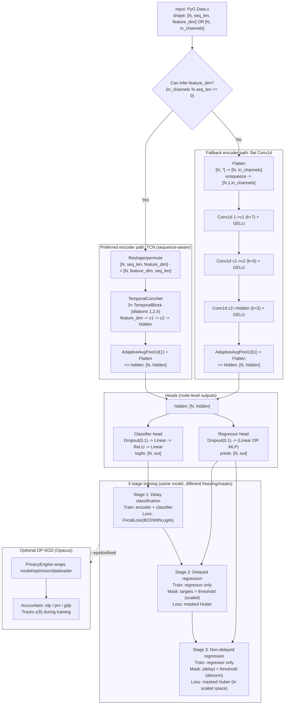

# CNNOpaCus model architecture (concise)

```mermaid
---
id: e3f2ea65-69b9-4dca-b062-31a0d38a4de7
---
flowchart TD
  %% Core model: SequentialTwoStagePredictor (in cnnopacus.py)

  A["Input: PyG Data.x\nshape: [N, seq_len, feature_dim] OR [N, in_channels]"]
  B{"Can infer feature_dim?\n(in_channels % seq_len == 0)"}

  A --> B

  subgraph TCN["Preferred encoder path: TCN (sequence-aware)"]
    T0["Reshape/permute\n[N, seq_len, feature_dim] -> [N, feature_dim, seq_len]"]
    T1["TemporalConvNet\n3× TemporalBlock (dilations 1,2,4)\nfeature_dim -> c1 -> c2 -> hidden"]
    T2["AdaptiveAvgPool1d(1) + Flatten\n=> hidden: [N, hidden]"]
    T0 --> T1 --> T2
  end

  subgraph FB["Fallback encoder path: flat Conv1d"]
    F0["Flatten\n[N, *] -> [N, in_channels]\nunsqueeze -> [N,1,in_channels]"]
    F1["Conv1d 1->c1 (k=7) + GELU"]
    F2["Conv1d c1->c2 (k=5) + GELU"]
    F3["Conv1d c2->hidden (k=3) + GELU"]
    F4["AdaptiveAvgPool1d(1) + Flatten\n=> hidden: [N, hidden]"]
    F0 --> F1 --> F2 --> F3 --> F4
  end
  B -- Yes --> T0
  B -- No --> F0

  subgraph HEADS["Heads (node-level outputs)"]
    direction TD
    H["hidden: [N, hidden]"]
    C["Classifier head\nDropout(0.1) -> Linear -> ReLU -> Linear\nlogits: [N, out]"]
    R["Regressor head\nDropout(0.1) -> (Linear OR MLP)\npreds: [N, out]"]
    H --> C
    H --> R
  end

  T2 --> H
  F4 --> H

  subgraph TRAIN["3-stage training (same model, different freezing/masks)"]
    direction TD
    S1["Stage 1: Delay classification\nTrain: encoder + classifier\nLoss: FocalLoss(BCEWithLogits)"]
    S2["Stage 2: Delayed regression\nTrain: regressor only\nMask: targets > threshold (scaled)\nLoss: masked Huber"]
    S3["Stage 3: Non-delayed regression\nTrain: regressor only\nMask: |delay| < threshold (denorm)\nLoss: masked Huber (in scaled space)"]
    S1 --> S2 --> S3
  end

  C --> S1
  R --> S2
  R --> S3

  subgraph DP["Optional DP-SGD (Opacus)"]
    direction TD
    D1["PrivacyEngine wraps model/optimizer/dataloader"]
    D2["Accountant: rdp / prv / gdp\nTracks ε(δ) during training"]
    D1 --> D2
  end

  TRAIN -. "if --dp or --epsilonfixed" .-> DP

  classDef box fill:#f7f7ff,stroke:#444,stroke-width:1px;
  class TCN,FB,HEADS,TRAIN,DP box;
```
